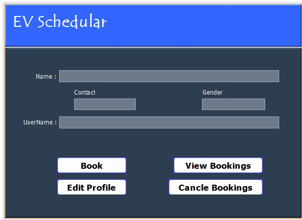
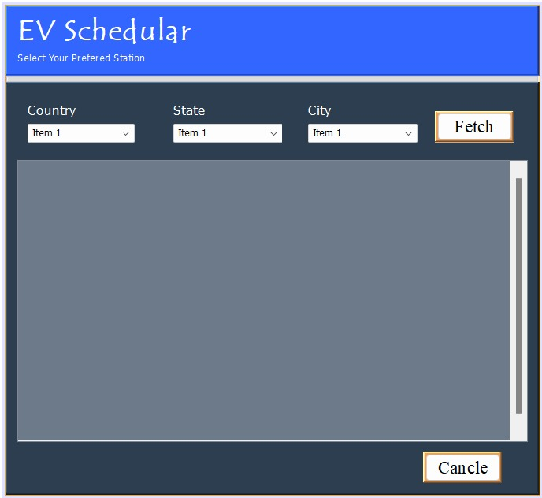
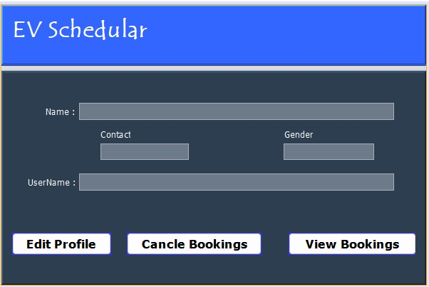

# EV-Recharge-Schedular
## Description

EV Recharging Scheduler using .NET and NetBeans is a straightforward software solution designed for efficient scheduling of electric vehicle (EV) recharging. This application simplifies the process, allowing users to easily plan and manage recharging sessions for both EV cars and bikes, enhancing convenience and optimizing resource utilization.

## Images

### User Homepage
#### 

### Reservation Page
#### 

### EV Station page
#### 
